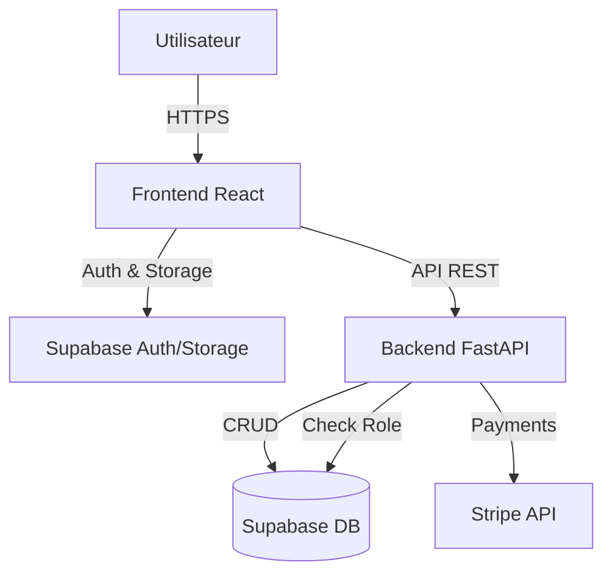

# Modelify - Plateforme de Demandes de Modélisation 3D

Modelify est une plateforme web complète permettant aux utilisateurs (particuliers et professionnels) de soumettre des demandes de projets de modélisation 3D. La plateforme gère le processus de la demande initiale jusqu'au paiement, avec une interface d'administration pour la gestion des utilisateurs et des projets.

## 🚀 Fonctionnalités Principales

- **Authentification & Gestion des Utilisateurs** :
    - Inscription et connexion via Email/Mot de passe (Supabase Auth).
    - Rôles utilisateurs : `particulier`, `professionnel`, et `admin`.
    - Sécurisation des accès via JWT et vérification des rôles en base de données.

- **Gestion de Projets** :
    - Soumission détaillée de projets (titre, description, usage, dimensions, budget, délais).
    - Upload de fichiers (images, PDF, ZIP) sécurisé avec validation MIME.
    - Suivi du statut des projets (en attente, validé, etc.).

- **Administration** :
    - Dashboard administrateur pour visualiser les métriques clés.
    - Gestion des utilisateurs (liste, détails).
    - Gestion centralisée des demandes de projets.

- **Paiement (Intégration Stripe)** :
    - Gestion des clients Stripe.
    - Création de devis (Quotes) et sessions de paiement.

## 🛠️ Stack Technique

### Frontend
- **Framework** : React 18 (Vite)
- **Langage** : JavaScript (JSX)
- **Styling** : Bootstrap 5 + CSS personnalisé
- **Gestionnaire d'état** : React Context (AuthContext)
- **HTTP Client** : Axios

### Backend
- **Framework** : FastAPI (Python 3.8+)
- **Base de Données** : PostgreSQL via Supabase
- **ORM** : SQLAlchemy (avec support Supabase-py)
- **Authentification** : Supabase Auth (JWT)
- **Paiement** : Stripe API

### Infrastructure
- **Conteneurisation** : Docker & Docker Compose
- **Serveur Web** : Nginx (pour le frontend en prod) / Uvicorn (Backend)
- **Stockage de Fichiers** : Supabase Storage

## 🏗️ Architecture et Flux de Données

⚠️ **Règle d'or** : Le Frontend ne communique **JAMAIS** directement avec la base de données pour les opérations CRUD. Toutes les requêtes passent par l'API Backend (FastAPI) pour garantir la validation, la sécurité et la logique métier.



## 🚀 Installation et Démarrage

### Option 1 : Docker (Recommandé)

1.  **Prérequis** : Docker et Docker Compose installés.
2.  **Configuration** : Créez les fichiers `.env` dans les dossiers `backend/` et `frontend/` (voir section Configuration).
3.  **Lancer le projet** :
    ```bash
    docker-compose up --build
    ```
    - Frontend : [http://localhost:3000](http://localhost:3000)
    - Backend API : [http://localhost:8000](http://localhost:8000)
    - Documentation API : [http://localhost:8000/docs](http://localhost:8000/docs)

### Option 2 : Installation Manuelle

#### Backend
1.  Aller dans le dossier backend : `cd backend`
2.  Créer un environnement virtuel :
    ```bash
    python -m venv venv
    # Windows
    venv\Scripts\activate
    # Linux/Mac
    source venv/bin/activate
    ```
3.  Installer les dépendances : `pip install -r requirements.txt`
4.  Lancer le serveur :
    ```bash
    uvicorn main:app --reload
    ```

#### Frontend
1.  Aller dans le dossier frontend : `cd frontend`
2.  Installer les dépendances : `npm install`
3.  Lancer le serveur de développement : `npm run dev`

## ⚙️ Configuration (Variables d'Environnement)

### Backend (`backend/.env`)

```env
# URL de l'instance Supabase
SUPABASE_URL=votre_url_supabase
# Clé de service (ou anon selon usage, service_role recommandé pour l'admin backend)
SUPABASE_KEY=votre_cle_supabase
# URL du Frontend pour CORS
FRONTEND_URL=http://localhost:3000
# Clé API Stripe
STRIPE_SECRET_KEY=votre_cle_secrete_stripe
```

### Frontend (`frontend/.env`)

```env
# URL de l'instance Supabase
VITE_SUPABASE_URL=votre_url_supabase
# Clé publique anonyme
VITE_SUPABASE_ANON_KEY=votre_cle_anon_supabase
# URL de l'API Backend
VITE_API_URL=http://localhost:8000
```

## 📂 Structure du Projet

```
Modelify/
├── backend/                # API FastAPI
│   ├── app/
│   │   ├── routers/        # Endpoints (projects, users)
│   │   ├── services/       # Logique métier (Stripe, etc.)
│   │   ├── schemas/        # Modèles Pydantic de validation
│   │   ├── database.py     # Configuration Supabase
│   │   └── dependencies.py # Middleware d'authentification
│   ├── main.py             # Point d'entrée de l'application
│   └── requirements.txt    # Dépendances Python
│
├── frontend/               # Application React
│   ├── public/             # Assets statiques
│   ├── src/
│   │   ├── components/     # Composants UI réutilisables
│   │   ├── contexts/       # Gestion d'état (AuthContext)
│   │   ├── lib/            # Clients externes (supabase.js)
│   │   ├── pages/          # Pages (Login, Home, Dashboard...)
│   │   ├── services/       # Appels API vers le backend
│   │   └── App.jsx         # Routing principal
│   ├── vite.config.js      # Configuration Vite
│   └── package.json        # Dépendances Node
│
├── docker-compose.yml      # Orchestration Docker
└── PROJECT_GUIDELINES.md   # Règles de développement et sécurité (A LIRE)
```

## 🧪 Tests

- **Backend** : `pytest` (Fichiers dans `backend/tests/`)
- **Frontend** : `npm test` (Vitest via `backend/tests` ou interne frontend selon config)

## 📄 Licence

Ce projet est développé dans le cadre de la certification DNA.
