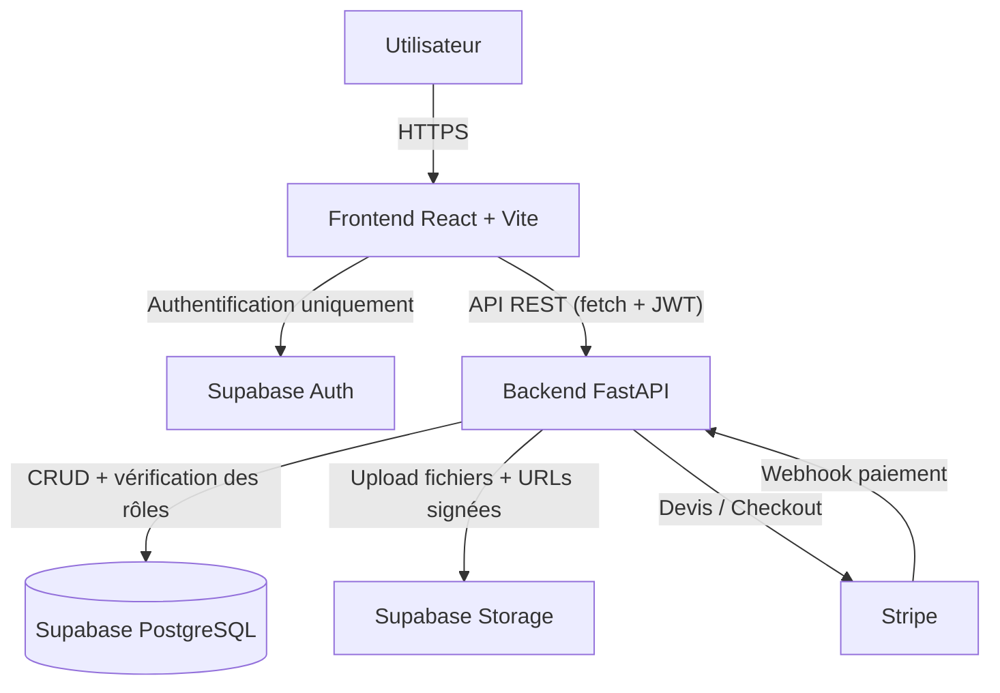

# Modelify - Plateforme de modélisation 3D à la demande

Modelify est une application web complète qui met en relation des clients avec un service de modélisation 3D. Elle couvre tout le cycle de vie d'une demande : soumission du projet avec fichiers de référence, devis, paiement en ligne via Stripe, puis livraison des fichiers 3D - ainsi qu'une boutique de modèles 3D prêts à l'emploi avec visionneuse 3D interactive.

> Projet développé dans le cadre de la certification **CDA (Concepteur Développeur d'Applications)**.

---

## Sommaire

1. [Fonctionnalités](#fonctionnalités)
2. [Stack technique](#stack-technique)
3. [Architecture](#architecture)
4. [Démarrage rapide](#démarrage-rapide)
5. [Tests](#tests)
6. [Variables d'environnement](#variables-denvironnement)
7. [API - vue d'ensemble](#api--vue-densemble)
8. [Structure du projet](#structure-du-projet)
9. [CI/CD](#cicd)

---

## Fonctionnalités

### 👤 Authentification & comptes
- Inscription / connexion par email et mot de passe (**Supabase Auth**, JWT).
- Deux rôles : `user` (client) et `admin`. L'inscription publique force le rôle `user` ; le rôle ne peut jamais être modifié via l'API de mise à jour du profil.
- Pour toute opération sensible, le rôle est **revérifié en base de données** côté backend (jamais uniquement depuis le JWT ou le state frontend).
- Routes protégées côté frontend (`ProtectedRoute`) et endpoints protégés côté backend (`get_current_user`).

### 📐 Demandes de projets 3D
- Formulaire de demande en plusieurs étapes (informations, dimensions, tranche de budget, délais) accessible depuis le portail client.
- Upload de fichiers de référence (JPEG, PNG, WebP, PDF, ZIP) avec **validation du type MIME réel** (python-magic) - maximum **5 fichiers de 10 Mo** chacun, stockés dans Supabase Storage (bucket `project-images`, accès via URLs signées).
- Limite de **2 projets actifs simultanés** par client (hors projets terminés ou refusés).
- Suivi du statut de bout en bout : `en attente` → `devis_envoyé` → `paiement_attente` → `payé` → `en cours` → `terminé` (ou `devis_refusé`).
- Devis Stripe : envoi par l'admin, puis paiement ou refus par le client, avec vérification du paiement au retour de Stripe.
- Livraison des fichiers 3D finaux (`.obj`, `.stl`, `.glb`, `.gltf`, `.fbx`, `.blend`, `.3ds`, `.dae`, `.mtl`) déposés par l'admin.
- **Messagerie intégrée** sur la page de détail du projet : discussion client ↔ admin (questions, suivi), avec envoi d'images pour montrer l'avancement (rafraîchissement automatique toutes les 10 s).

### 🛒 Boutique de modèles 3D
- Catalogue de produits présenté sur la page d'accueil, avec **aperçu 3D interactif** (three.js - formats OBJ, STL, 3MF, GLTF/GLB).
- Panier persistant (store Zustand) et paiement via **Stripe Checkout**.
- Confirmation de commande asynchrone via **webhook Stripe** (signature vérifiée).
- Historique des commandes et re-téléchargement des modèles achetés depuis le portail client.

### 🗂️ Portail client (`/app`)
Interface unique pilotée par un paramètre d'URL `?view=` : profil, nouveau projet, suivi des projets personnalisés, commandes de la boutique - et pour l'admin : gestion des utilisateurs, des projets par statut (en attente / en cours / terminés) et des documents légaux.

### 🛠️ Administration
- Gestion des demandes de projets : changement de statut, envoi de devis, dépôt des livrables.
- Gestion des utilisateurs et consultation de leurs projets.
- CRUD des produits de la boutique.
- Édition des documents légaux (CGV, mentions légales…).

---

## Stack technique

| Couche | Technologies |
|---|---|
| **Frontend** | React 18, Vite 7, React Router 6, Bootstrap 5 + CSS par composant, Zustand (panier), three.js + React Three Fiber + drei (visionneuse 3D) |
| **Backend** | FastAPI (Python), Pydantic, python-jose (validation JWT), python-magic (validation MIME) |
| **Base de données** | PostgreSQL managé par **Supabase** (avec Row Level Security) |
| **Auth & stockage fichiers** | Supabase Auth (JWT) et Supabase Storage |
| **Paiement** | Stripe (devis, Checkout, webhooks) |
| **Tests** | Vitest 4 + React Testing Library + happy-dom (frontend) · pytest (backend) |
| **Infra** | Docker & Docker Compose, Nginx (frontend en prod), GitHub Actions (CI/CD), images publiées sur GHCR |

---

## Architecture


```mermaid
graph TD
    User[Utilisateur] -->|HTTPS| React[Frontend React + Vite]
    React -->|Authentification uniquement| SupaAuth[Supabase Auth]
    React -->|"API REST (fetch + JWT)"| API[Backend FastAPI]
    API -->|CRUD + vérification des rôles| DB[(Supabase PostgreSQL)]
    API -->|Upload fichiers + URLs signées| Storage[Supabase Storage]
    API -->|Devis / Checkout| Stripe[Stripe]
    Stripe -->|Webhook paiement| API
```

**Règle d'architecture centrale** : le frontend ne parle **jamais** directement à la base de données. Toutes les opérations de données passent par l'API FastAPI, qui centralise la validation (Pydantic), la logique métier et les contrôles d'autorisation. Le client Supabase côté frontend sert **uniquement** à l'authentification. Tous les appels API passent par un point d'entrée unique : [`frontend/src/lib/api.js`](frontend/src/lib/api.js) (`apiFetch`).

**Authentification côté API** : chaque requête porte un JWT Supabase en header `Authorization: Bearer`. Si `SUPABASE_JWT_SECRET` est configuré, le token est validé localement (python-jose) ; sinon - ou en cas d'échec - l'API interroge Supabase Auth. Le rôle admin est ensuite systématiquement revérifié dans la table `Users`.

Les règles détaillées (sécurité, rôles, RLS, conventions) sont dans [PROJECT_GUIDELINES.md](PROJECT_GUIDELINES.md) - **à lire avant toute contribution**.

---

## Démarrage rapide

### Option 1 - Docker (recommandé)

**Prérequis** : Docker + Docker Compose, un fichier `backend/.env` rempli (voir [Variables d'environnement](#variables-denvironnement)).

```bash
docker-compose up --build
```

| Service | URL | Détail |
|---|---|---|
| Frontend | http://localhost:3000 | Build Vite servi par Nginx (port 80 dans le conteneur) |
| API backend | http://localhost:8000 | Uvicorn avec hot reload (code monté en volume) |
| Documentation API (Swagger) | http://localhost:8000/docs | Générée par FastAPI |

> Les variables `VITE_*` du frontend sont injectées **au build** de l'image (build args dans `docker-compose.yml`), pas au démarrage du conteneur.

### Option 2 - Installation manuelle

**Backend** (Python 3.10+ ; l'image Docker utilise Python 3.11) :

```bash
cd backend
python -m venv venv
venv\Scripts\activate        # Windows
source venv/bin/activate     # Linux / macOS
pip install -r requirements.txt
uvicorn main:app --reload
```

> Sous Linux, python-magic nécessite la bibliothèque système `libmagic1` (`sudo apt-get install libmagic1`). L'API démarre même sans : la validation MIME est alors simplement désactivée (import optionnel).

**Frontend** (Node 18+) :

```bash
cd frontend
npm install
npm run dev        # sert sur http://localhost:3000
```

### Webhooks Stripe en développement

Pour recevoir les confirmations de paiement en local, redirigez les événements Stripe vers l'API avec la CLI Stripe :

```bash
stripe login
stripe listen --forward-to localhost:8000/api/webhook
```

Copiez le secret `whsec_...` affiché dans `STRIPE_WEBHOOK_SECRET` (fichier `backend/.env`).

---

## Tests

### Frontend - Vitest + React Testing Library

```bash
cd frontend
npm run test        # exécution unique (watch désactivé dans vite.config.js)
npm run test:ci     # équivalent explicite utilisé en CI
```

Les tests (`src/**/*.test.jsx`, environnement happy-dom) couvrent l'inscription, la connexion, le formulaire de projet multi-étapes, la navbar (dont l'affichage selon le rôle), le footer et la protection des routes.

### Backend - pytest

Les dépendances de test ne sont pas dans `requirements.txt` (elles sont installées à part, comme en CI) :

```bash
pip install pytest pytest-asyncio
```

Les tests tournent en mode mock (`TESTING=true`) : aucune connexion réelle à Supabase ou Stripe n'est nécessaire.

```bash
cd backend

# Linux / macOS
TESTING=true STRIPE_SECRET_KEY=sk_test_mock SUPABASE_URL=https://mock.supabase.co \
SUPABASE_KEY=mock_key SECRET_KEY=test_secret_key pytest -v
```

```powershell
# Windows (PowerShell)
cd backend
$env:TESTING='true'; $env:STRIPE_SECRET_KEY='sk_test_mock'
$env:SUPABASE_URL='https://mock.supabase.co'; $env:SUPABASE_KEY='mock_key'
$env:SECRET_KEY='test_secret_key'
py -m pytest -v
```

> ⚠️ **Windows** : lancez pytest depuis **PowerShell**, pas depuis Git Bash. Le PATH de Git Bash expose une DLL `libmagic` (msys) incompatible qui fait planter Python au chargement de `python-magic`.

La suite backend comprend des **tests unitaires** (`test_auth_unit.py`, `test_users_unit.py`, `test_projects_unit.py` : authentification JWT, contrôle d'accès par rôle, validation des fichiers, cycle de vie des devis) et des **tests d'intégration** (`test_integration.py` : flux complet de création de projet via l'API, gestion des erreurs, health check). Les mocks partagés sont dans `base_test.py`.

---

## Variables d'environnement

Un modèle est fourni dans [`backend/.env.example`](backend/.env.example).

### Backend (`backend/.env`)

| Variable | Rôle | Obligatoire |
|---|---|---|
| `SUPABASE_URL` | URL de l'instance Supabase | ✅ (vérifiée au démarrage) |
| `SUPABASE_KEY` | Clé anon Supabase (opérations standard) | ✅ (vérifiée au démarrage) |
| `SUPABASE_SERVICE_KEY` | Clé service_role (opérations admin, bypass RLS storage) | ✅ |
| `STRIPE_SECRET_KEY` | Clé secrète API Stripe | ✅ |
| `STRIPE_WEBHOOK_SECRET` | Secret de signature du webhook Stripe | ✅ (paiements) |
| `FRONTEND_URL` | URL du frontend : CORS + URLs de redirection Stripe | ✅ |
| `SUPABASE_JWT_SECRET` | Active la validation locale des JWT (évite un appel réseau à Supabase par requête) | Optionnel |
| `TESTING` | `true` pour utiliser les mocks (tests uniquement) | Optionnel |

### Frontend (`frontend/.env`)

| Variable | Rôle |
|---|---|
| `VITE_SUPABASE_URL` | URL de l'instance Supabase |
| `VITE_SUPABASE_ANON_KEY` | Clé publique anonyme (auth uniquement) |
| `VITE_API_URL` | URL de l'API backend (ex. `http://localhost:8000`) |

> 🔒 Ne commitez jamais de fichier `.env` (ils sont ignorés par git) : seul `backend/.env.example` est versionné, sans aucun secret.

---

## API - vue d'ensemble

Toutes les routes métier sont préfixées par `/api`. Documentation interactive complète sur `/docs` (Swagger UI).

| Domaine | Routes principales | Description |
|---|---|---|
| **Projets** | `GET/POST /projects`, `GET /projects/count`, `GET/PUT /projects/{id}`, `PUT /projects/{id}/status` (admin), `POST /projects/{id}/files` (admin) | Demandes de modélisation, statuts, livrables |
| **Devis & paiement** | `POST /projects/{id}/quote` (admin), `POST /projects/{id}/quote/refuse`, `POST /projects/{id}/pay`, `GET /projects/{id}/verify-payment` | Cycle devis → paiement Stripe |
| **Messagerie projet** | `GET/POST /projects/{id}/messages` | Discussion client ↔ admin avec images jointes (URLs signées) |
| **Utilisateurs** | `POST /users`, `GET/PUT /users/me`, `GET /users` (admin) | Comptes et profils |
| **Boutique** | `GET/POST /products`, `PUT/DELETE /products/{id}` (admin), `POST /products/{id}/buy`, `GET /products/{id}/purchased` | Catalogue et achat de modèles 3D |
| **Panier & commandes** | `POST /cart/checkout`, `GET /cart/purchased-ids`, `GET /cart/order-status`, `GET /orders/mine` | Checkout Stripe et suivi des commandes |
| **Légal** | `GET /legal`, `PUT /legal/{slug}` (admin) | Documents légaux |
| **Webhooks** | `POST /webhook` | Confirmations de paiement Stripe (signature vérifiée) |
| **Santé** | `GET /` et `GET /health` (sans préfixe) | État de l'API et de la connexion base de données |

---

## Structure du projet

```
Modelify/
├── backend/                      # API FastAPI
│   ├── main.py                   # Point d'entrée : validation env, CORS, routers, health check
│   ├── app/
│   │   ├── database.py           # Clients Supabase (anon + service_role, mocks si TESTING)
│   │   ├── dependencies.py       # Auth : validation JWT (locale ou via Supabase)
│   │   ├── routers/              # Endpoints par domaine
│   │   │   ├── projects.py       #   projets, fichiers, devis, paiement
│   │   │   ├── users.py          #   comptes, profils, admin
│   │   │   ├── products.py       #   boutique
│   │   │   ├── cart.py           #   panier, checkout, commandes
│   │   │   ├── legal.py          #   documents légaux
│   │   │   └── webhooks.py       #   webhook Stripe
│   │   ├── schemas/              # Modèles Pydantic (validation entrées/sorties)
│   │   └── services/
│   │       └── stripe_service.py # Logique Stripe (clients, devis, checkout)
│   ├── tests/                    # Tests unitaires + intégration (pytest)
│   ├── Dockerfile                # python:3.11-slim + libmagic1
│   ├── .env.example
│   └── requirements.txt
│
├── frontend/                     # Application React (Vite)
│   ├── src/
│   │   ├── App.jsx               # Routing (routes secondaires en lazy loading)
│   │   ├── lib/
│   │   │   ├── api.js            # apiFetch : point d'entrée unique vers l'API
│   │   │   └── supabase.js       # Client Supabase (auth uniquement)
│   │   ├── contexts/AuthContext.jsx  # Session + rôle réel récupéré via GET /users/me
│   │   ├── store/cartStore.js    # Panier (Zustand)
│   │   ├── constants/projectStatus.js # Libellés statuts / budgets partagés
│   │   ├── components/           # UI réutilisable (visionneuse 3D, modales, toasts…)
│   │   │   ├── dashboard/        #   cartes du portail (profil, projets, commandes)
│   │   │   └── forms/            #   formulaire de projet multi-étapes
│   │   ├── layout/               # Navbar, Footer
│   │   ├── pages/                # Home (+ boutique), Cart, portail /app, admin, auth, légal, paiement
│   │   └── **/*.test.jsx         # Tests Vitest colocalisés
│   ├── Dockerfile                # Build Vite (node:18-alpine) → nginx:alpine
│   ├── nginx.conf                # Config Nginx (image Docker de prod)
│   ├── vite.config.js            # Port 3000, build vers build/, config Vitest (happy-dom)
│   └── package.json
│
├── docker-compose.yml            # Orchestration backend (8000) + frontend (3000)
├── .github/workflows/ci-cd.yml   # Pipeline CI/CD
└── PROJECT_GUIDELINES.md         # Règles de développement et de sécurité (À LIRE)
```

---

## CI/CD

Le pipeline GitHub Actions ([`.github/workflows/ci-cd.yml`](.github/workflows/ci-cd.yml)) s'exécute sur chaque push et pull request vers `main` :

1. **backend-ci** - Python 3.10, installation de `libmagic1` et des dépendances, puis `pytest -v` avec les variables d'environnement mock (`TESTING=true`).
2. **frontend-ci** - Node 18, `npm ci`, exécution de la suite Vitest, puis build de production Vite.
3. **docker-build** *(uniquement sur push vers `main`, si les deux jobs précédents réussissent)* - build des images Docker backend et frontend et publication sur **GitHub Container Registry** (`ghcr.io/<owner>/modelify-backend` et `modelify-frontend`).

---

## Licence

Projet pédagogique réalisé dans le cadre de la certification **Concepteur Développeur d'Applications (CDA)**.
