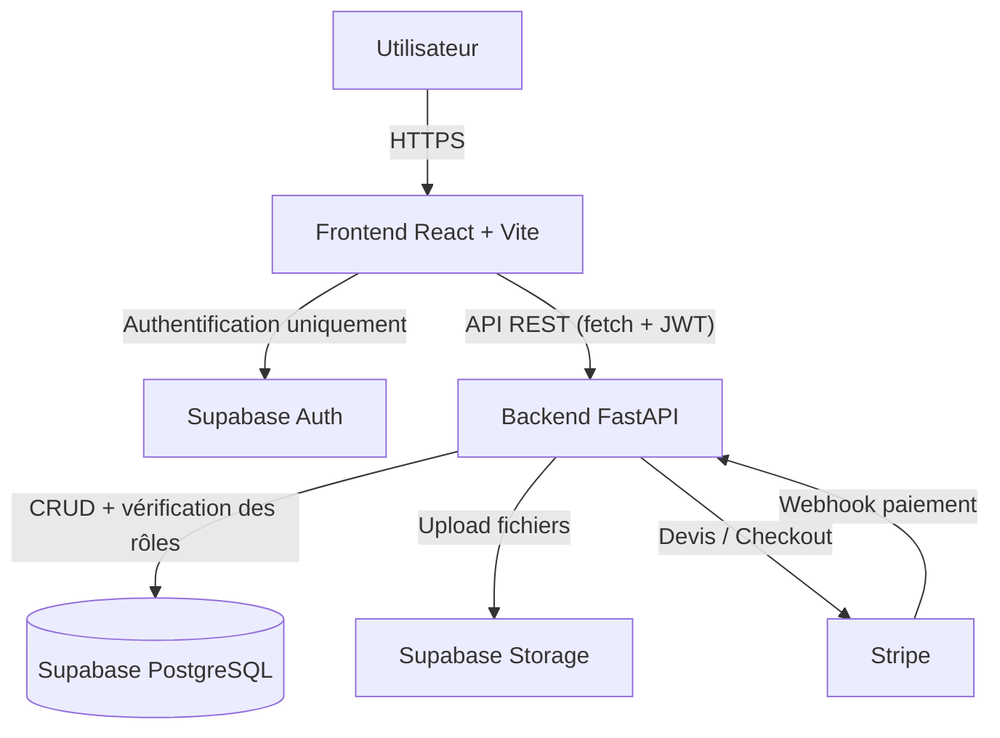

# Modelify — Plateforme de modélisation 3D à la demande

Modelify est une application web complète qui met en relation des clients (particuliers et professionnels) avec un service de modélisation 3D. Elle couvre tout le cycle de vie d'une demande : soumission du projet, devis, paiement en ligne, livraison des fichiers 3D — ainsi qu'une boutique de modèles 3D prêts à l'emploi avec visionneuse 3D intégrée.

> Projet développé dans le cadre de la certification **CDA (Concepteur Développeur d'Applications)**.

---

## Sommaire

1. [Fonctionnalités](#fonctionnalités)
2. [Stack technique](#stack-technique)
3. [Architecture](#architecture)
4. [Démarrage rapide](#démarrage-rapide)
5. [Tests](#tests)
6. [Variables d'environnement](#variables-denvironnement)
7. [API — vue d'ensemble](#api--vue-densemble)
8. [Structure du projet](#structure-du-projet)
9. [CI/CD](#cicd)

---

## Fonctionnalités

### 👤 Authentification & comptes
- Inscription / connexion par email et mot de passe (**Supabase Auth**, JWT).
- Trois rôles : `particulier`, `professionnel`, `admin`.
- Le rôle est **toujours vérifié en base de données** côté backend (jamais uniquement depuis le JWT ou le state frontend).
- Routes protégées côté frontend (`ProtectedRoute`) et endpoints protégés côté backend (`get_current_user`).

### 📐 Demandes de projets 3D
- Formulaire de demande en plusieurs étapes (informations, dimensions, budget, délais).
- Upload de fichiers de référence (images, PDF, ZIP) avec **validation du type MIME réel** (python-magic) et limite de 5 fichiers / 10 Mo.
- Suivi du statut du projet de bout en bout : `en attente` → `devis_envoyé` → `paiement_attente` → `payé` → `en cours` → `terminé` (ou `devis_refusé`).
- Devis Stripe : création, acceptation et paiement, ou refus par le client.
- Livraison des fichiers 3D finaux (`.obj`, `.stl`, `.glb`, `.fbx`…) déposés par l'admin.

### 🛒 Boutique de modèles 3D
- Catalogue de produits avec **aperçu 3D interactif** (three.js — formats OBJ, STL, 3MF…).
- Panier (store Zustand persistant) et paiement via **Stripe Checkout**.
- Confirmation de commande asynchrone via **webhook Stripe**.
- Historique des commandes dans le portail client.

### 🛠️ Administration
- Gestion des demandes de projets (changement de statut, envoi de devis, livrables).
- Gestion des utilisateurs.
- CRUD des produits de la boutique.
- Édition des documents légaux (CGV, mentions légales…).

---

## Stack technique

| Couche | Technologies |
|---|---|
| **Frontend** | React 18, Vite 7, React Router 6, Bootstrap 5 + CSS par composant, Zustand (panier), three.js + React Three Fiber (visionneuse 3D) |
| **Backend** | FastAPI (Python 3.10+), Pydantic, python-jose (JWT), python-magic (validation MIME) |
| **Base de données** | PostgreSQL managé par **Supabase** (avec Row Level Security) |
| **Auth & stockage fichiers** | Supabase Auth (JWT) et Supabase Storage |
| **Paiement** | Stripe (devis, Checkout, webhooks) |
| **Tests** | Vitest + React Testing Library (frontend) · pytest (backend) |
| **Infra** | Docker & Docker Compose, Nginx (frontend en prod), GitHub Actions (CI/CD), images publiées sur GHCR |

---

## Architecture


```mermaid
graph TD
    User[Utilisateur] -->|HTTPS| React[Frontend React + Vite]
    React -->|Authentification uniquement| SupaAuth[Supabase Auth]
    React -->|"API REST (fetch + JWT)"| API[Backend FastAPI]
    API -->|CRUD + vérification des rôles| DB[(Supabase PostgreSQL)]
    API -->|Upload fichiers| Storage[Supabase Storage]
    API -->|Devis / Checkout| Stripe[Stripe]
    Stripe -->|Webhook paiement| API
```

**Règle d'architecture centrale** : le frontend ne parle **jamais** directement à la base de données. Toutes les opérations de données passent par l'API FastAPI, qui centralise la validation (Pydantic), la logique métier et les contrôles d'autorisation. Le client Supabase côté frontend sert **uniquement** à l'authentification. Tous les appels API passent par un point d'entrée unique : [`frontend/src/lib/api.js`](frontend/src/lib/api.js) (`apiFetch`).

Les règles détaillées (sécurité, rôles, RLS, conventions) sont dans [PROJECT_GUIDELINES.md](PROJECT_GUIDELINES.md) — **à lire avant toute contribution**.

---

## Démarrage rapide

### Option 1 — Docker (recommandé)

**Prérequis** : Docker + Docker Compose, un fichier `backend/.env` rempli (voir [Variables d'environnement](#variables-denvironnement)).

```bash
docker-compose up --build
```

| Service | URL |
|---|---|
| Frontend | http://localhost:3000 |
| API backend | http://localhost:8000 |
| Documentation API (Swagger) | http://localhost:8000/docs |

### Option 2 — Installation manuelle

**Backend** (Python 3.10+) :

```bash
cd backend
python -m venv venv
venv\Scripts\activate        # Windows
source venv/bin/activate     # Linux / macOS
pip install -r requirements.txt
uvicorn main:app --reload
```

**Frontend** (Node 18+) :

```bash
cd frontend
npm install
npm run dev
```

### Webhooks Stripe en développement

Pour recevoir les confirmations de paiement en local, redirigez les événements Stripe vers l'API avec la CLI Stripe :

```bash
stripe login
stripe listen --forward-to localhost:8000/api/webhook
```

Copiez le secret `whsec_...` affiché dans `STRIPE_WEBHOOK_SECRET` (fichier `backend/.env`).

---

## Tests

### Frontend — Vitest + React Testing Library

```bash
cd frontend
npm run test        # mode watch (développement)
npm run test:ci     # exécution unique (comme en CI)
```

Les tests (`src/**/*.test.jsx`) couvrent l'inscription, la connexion, le formulaire de projet multi-étapes, la navbar (dont l'affichage selon le rôle), le footer et la protection des routes.

### Backend — pytest

Les dépendances de test ne sont pas dans `requirements.txt` (elles sont installées à part, comme en CI) :

```bash
pip install pytest pytest-asyncio
```

Les tests tournent en mode mock (`TESTING=true`) : aucune connexion réelle à Supabase ou Stripe n'est nécessaire.

```bash
cd backend

# Linux / macOS
TESTING=true STRIPE_SECRET_KEY=sk_test_mock SUPABASE_URL=https://mock.supabase.co \
SUPABASE_KEY=mock_key SECRET_KEY=test_secret_key pytest -v
```

```powershell
# Windows (PowerShell)
cd backend
$env:TESTING='true'; $env:STRIPE_SECRET_KEY='sk_test_mock'
$env:SUPABASE_URL='https://mock.supabase.co'; $env:SUPABASE_KEY='mock_key'
$env:SECRET_KEY='test_secret_key'
py -m pytest -v
```

> ⚠️ **Windows** : lancez pytest depuis **PowerShell**, pas depuis Git Bash. Le PATH de Git Bash expose une DLL `libmagic` (msys) incompatible qui fait planter Python au chargement de `python-magic`.

La suite backend comprend des **tests unitaires** (`test_auth_unit.py`, `test_users_unit.py`, `test_projects_unit.py` : authentification JWT, contrôle d'accès par rôle, validation des fichiers, cycle de vie des devis) et des **tests d'intégration** (`test_integration.py` : flux complet de création de projet via l'API, gestion des erreurs, health check).

---

## Variables d'environnement

Un modèle complet est fourni dans [`backend/.env.example`](backend/.env.example).

### Backend (`backend/.env`)

| Variable | Rôle | Obligatoire |
|---|---|---|
| `SUPABASE_URL` | URL de l'instance Supabase | ✅ |
| `SUPABASE_KEY` | Clé anon Supabase (opérations standard) | ✅ |
| `SUPABASE_SERVICE_KEY` | Clé service_role (opérations admin, bypass RLS) | ✅ |
| `STRIPE_SECRET_KEY` | Clé secrète API Stripe | ✅ |
| `STRIPE_WEBHOOK_SECRET` | Secret de signature du webhook Stripe | ✅ (paiements) |
| `FRONTEND_URL` | URL du frontend, pour la configuration CORS | ✅ |
| `SUPABASE_JWT_SECRET` | Permet la validation locale des JWT (optimisation : évite un appel réseau à Supabase par requête) | Optionnel |

### Frontend (`frontend/.env`)

| Variable | Rôle |
|---|---|
| `VITE_SUPABASE_URL` | URL de l'instance Supabase |
| `VITE_SUPABASE_ANON_KEY` | Clé publique anonyme (auth uniquement) |
| `VITE_API_URL` | URL de l'API backend (ex. `http://localhost:8000`) |

> 🔒 Ne commitez jamais de fichier `.env` : seuls les `.env.example` sont versionnés.

---

## API — vue d'ensemble

Toutes les routes sont préfixées par `/api`. Documentation interactive complète sur `/docs` (Swagger UI).

| Domaine | Exemples de routes | Description |
|---|---|---|
| **Projets** | `GET/POST /projects`, `GET/PUT /projects/{id}`, `POST /projects/{id}/files` | Demandes de modélisation, upload de fichiers |
| **Devis & paiement** | `POST /projects/{id}/quote`, `/quote/refuse`, `/pay`, `GET /projects/{id}/verify-payment` | Cycle devis → paiement Stripe |
| **Utilisateurs** | `POST /users`, `GET/PUT /users/me`, `GET /users` (admin) | Comptes et profils |
| **Boutique** | `GET/POST /products`, `PUT/DELETE /products/{id}`, `POST /products/{id}/buy` | Catalogue et achat de modèles 3D |
| **Panier & commandes** | `POST /cart/checkout`, `GET /orders/mine`, `GET /cart/order-status` | Checkout Stripe et suivi des commandes |
| **Légal** | `GET /legal`, `PUT /legal/{slug}` (admin) | Documents légaux |
| **Webhooks** | `POST /webhook` | Confirmations de paiement Stripe (signature vérifiée) |
| **Santé** | `GET /health` (sans préfixe) | État de l'API et de la connexion base de données |

---

## Structure du projet

```
Modelify/
├── backend/                      # API FastAPI
│   ├── main.py                   # Point d'entrée : CORS, routers, health check
│   ├── app/
│   │   ├── database.py           # Clients Supabase (anon + service_role)
│   │   ├── dependencies.py       # Auth : validation JWT (locale ou via Supabase)
│   │   ├── routers/              # Endpoints par domaine
│   │   │   ├── projects.py       #   projets, fichiers, devis, paiement
│   │   │   ├── users.py          #   comptes, profils, admin
│   │   │   ├── products.py       #   boutique
│   │   │   ├── cart.py           #   panier, checkout, commandes
│   │   │   ├── legal.py          #   documents légaux
│   │   │   └── webhooks.py       #   webhook Stripe
│   │   ├── schemas/              # Modèles Pydantic (validation entrées/sorties)
│   │   └── services/
│   │       └── stripe_service.py # Logique Stripe (clients, devis, checkout)
│   ├── tests/                    # Tests unitaires + intégration (pytest)
│   └── requirements.txt
│
├── frontend/                     # Application React (Vite)
│   ├── src/
│   │   ├── App.jsx               # Routing principal
│   │   ├── lib/
│   │   │   ├── api.js            # apiFetch : point d'entrée unique vers l'API
│   │   │   └── supabase.js       # Client Supabase (auth uniquement)
│   │   ├── contexts/AuthContext.jsx  # Session + rôle réel récupéré en BDD
│   │   ├── store/cartStore.js    # Panier (Zustand)
│   │   ├── components/           # UI réutilisable (visionneuse 3D, modales, formulaires…)
│   │   ├── layout/               # Navbar, Footer
│   │   ├── pages/                # Pages (portail, boutique, admin, auth…)
│   │   └── **/*.test.jsx         # Tests Vitest colocalisés
│   ├── nginx.conf                # Config Nginx (image Docker de prod)
│   └── package.json
│
├── docker-compose.yml            # Orchestration backend (8000) + frontend (3000)
├── .github/workflows/ci-cd.yml   # Pipeline CI/CD
└── PROJECT_GUIDELINES.md         # Règles de développement et de sécurité (À LIRE)
```

---

## CI/CD

Le pipeline GitHub Actions ([`.github/workflows/ci-cd.yml`](.github/workflows/ci-cd.yml)) s'exécute sur chaque push et pull request vers `main` :

1. **backend-ci** — installation des dépendances Python et exécution de `pytest` (avec variables d'environnement mock).
2. **frontend-ci** — installation npm, exécution de la suite Vitest, puis build de production Vite.
3. **docker-build** *(uniquement sur push vers `main`, si les deux jobs précédents réussissent)* — build des images Docker backend et frontend et publication sur **GitHub Container Registry** (`ghcr.io`).

---

## Licence

Projet pédagogique réalisé dans le cadre de la certification **Concepteur Développeur d'Applications (CDA)**.
